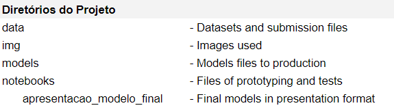

<h1 align="center">Hotel Chain Cancellation Rating</h1>

Projeto desenvolvido durante o evento <em>4º Hackday CDS</em> (Comunidade Data Science), utilizando algoritmos de Machine Learning via Python, para solucionar um problema de classificação. 

Objetivos: Simular ambiente de negócio real | Trabalho em equipe | Networking | Aceleração do conhecimento | Ferramentas 

Table of Content
=================

 <a href="#10-business-problem">Business Problem</a> •
 <a href="#20-business-assumptions">Business Assumptions</a> •
 <a href="#30-solution-strategy">Solution Strategy</a> • 
 <a href="#40-top-3-insights">Top 3 Insights</a> • 
 <a href="#50-conclusion">Conclusion</a> • 
 <a href="#60-lessons-learned">Lessons Learned</a> • 
 <a href="#70-how-to-use">How to use</a> • 
 <a href="#next-steps">Next Steps</a> • 
 <a href="#references">References</a> • 
 <a href="#autor">Autor</a> • 
 <a href="#team">Team</a>  • 
 <a href="#license">License</a> • 

# 1.0 Business Problem

A rede hoteleira espanhola Consta del Data, possui hotéis de 4 e 5 estrelas.

Com a reabertura pós-Covid, houve um aumento na taxa de cancelamento, diferente do que era esperado pelo setor. Vale ressaltar que a Espanha está entre os maiores países afetados pela pandemia e possuem mais de 10% de participação do setor de viagens em suas economias.

A empresa suspendeu ações estratégicas críticas como:

  - Expansão da rede hoteleira
  - Reforma das unidades com obras já programadas
  - Ações de marketing direcionadas

## Target

- Desenvolver um modelo de previsão de cancelamento
- Identificar o público com menor incidência de cancelamento e reverter o cenário

# 2.0 Business Assumptions

- Foram desconsiderados fatores recentes como conflitos armados
- Foram desconsiderados fatores ligados a aumento de preços energéticos
- Não foram analisados acordos comerciais e aprovações orçamentárias (Na Europa ou mesmo no Mundo) 

# 3.0 Solution Strategy

 A solução do problema se dará com base no ciclo CRISP, em alguns passos que foram adaptados a metodologia. Aplicamos um modelo de Machine Learning de classificação:

- <b> Coletando dados </b>: coleta de dados de um dataset, disponibilizado pela organização do evento, na plataforma Kaggle.
- <b> Limpeza dos dados </b>: Verificação de tipos de dados e Nan's, renomear colunas, lidar com outliers.
- <b> Feature Engineering </b>: Apesar da criação das novas features no momento de prototipação, nenhuma se mostrou importante para o modelo.
- <b> Exploratory Data Analysis (EDA) </b>: Os dados foram explorados para obter experiência de negócios, buscar insights úteis e encontrar recursos importantes para o modelo de ML. 
- <b> Preparação de Dados </b>:
    - Técnica de Rescala: aplicada nos dados numéricos
    - Técnica de Frequência: aplicada nos dados categóricos.
    - Dados Faltantes: atribuído valor 0 (zero) nos campos que estavam com NaN.
- <b> Seleção de features </b>: Todas as features foram utilizadas, mesmo a avaliação de importância mostrar que algumas eram irrelevantes para o resultado final do modelo.
- <b> Machine Learning Modeling </b>: 
    - Foram treinados os algoritmos: XGBoost, SVM, Decision Tree, Random Forest e Logistic Regressor.
- <b> Hyperparameter Fine Tunning </b>: 
    - Fazer ajuste fino de hiperparâmetros para identificar o melhor conjunto de parâmetros dos algoritmos e maximizar suas capacidades de aprendizagem.
    - O ajuste foi realizado nos modelos XGBoost e Random Forest, pois se mostraram mais acertivos na classificação.
- <b> Performance do modelo </b>: 
    - Calcular F1 Score (macro) de cada algoritmo treinado
    - XGBoost - Média ponderada com F1 Score (dados teste): 0.9719
    - O modelo apresenta boa capacidade de generalização (classificar dados inéditos)

# 4.0 Top 3 Insights

### H1: A safra de clientes tem relação com os cancelamentos
Premissa: Os IDs são sequênciais e contínuos (não aleatórios) ,portanto, tem relação com o tempo
Insight: Percebe-se que os IDs de 1 a 20000 e de 50000 a 80000 são os intervalos com maior quantidade de cancelamentos, acreditamos que pode estar diretamente relacionado a pandemia do Covid-19, períodos em que houve aumento de restrições, ou outros fatores externos que podem ter ocasionado no cancelamento de viagens e impactando nos números do Hotel.

### H2: Clientes com reservas feitas com um período muito longo, cancelam mais
Insight: Os clientes que cancelam o agendamento tem os valores de tempo da reserva até o check-in maior. Com isso, podem ser feitas ações com o time de marketing (comunicações) para manter o engajamento desses clientes.

### H3: Reservas que possuem observações tem uma taxa de cancelamento menor
Insight: Cerca de 75% das reservas canceladas não tem observação. As reservas sem observação representa o maior volume (60%) e elas representam 75% dos cancelamentos. Está informação evidência a necessidade de realizar ações para manter o engajamento deste público com sua reserva.

# 5.0 Conclusion

- O algoritmo que teve a melhor performance foi o XGBoost
- O resultado da métrica F1-Score foi de 97%
- Esse valor representa o acerto na classificação dos clientes que irão cancelar

# 6.0 Lessons Learned

- Em projetos com curto espaço de tempo, importante estruturar e executar um modelo o mais rápido possível, pois o resultado servirá de baseline para os próximos.
- Planejar, definir e designar bem as atividades de cada participante.
- Focar em discussões para a criação de novas features.
- Conhecer sobre o negócio e entender as features do dataset original.

# 7.0 How to use

+ Executar o comando em ambiente local: <em>git clone https://github.com/mbouhid/iv_hackday.git</em>
+ Instalar as bibliotecas que estão no arquivo <em>requirements.txt</em>
+ Executar o arquivo <em>models/model.py</em>

## Tools

As seguintes ferramentas foram usadas na construção do projeto:

- [Python](https://www.python.org/)
- [Pandas](https://pandas.pydata.org/)
- [Jupyter Notebook](https://jupyter.org/)
- [Github](https://github.com/)
- [SKLearn](https://scikit-learn.org/stable/)
- [XGBoost](https://xgboost.readthedocs.io/en/stable/)

# Next Steps

+ Coletar dados de outras fontes (webscrapping)
+ Treinar o modelo incluindo os novos dados coletados
+ Criar um modelo de ranqueamento, para identificar em real-time a propensão de cancelamento, e ações de MKT sejam executadas antes do cancelamento do cliente.

# References

[Kaggle](https://www.kaggle.com/competitions/cdshackdays4)

[Comunidade Data Science](https://www.comunidadedatascience.com/)

[Métrica F1-Score](https://scikit-learn.org/stable/modules/generated/sklearn.metrics.f1_score.html)

# Autor

 

# Team

Marcio Bouhid

- **André Luis** (Minas Gerais-BR) 
- **Marcio Bouhid** (Braga-Portugal) (https://www.linkedin.com/in/marciobouhid/)
- **Michele Lopes** (Itajaí-BR) (https://www.linkedin.com/in/michele-beatriz-lopes/)
- **Rodrigo Cruz** (Belém-BR) (https://www.linkedin.com/in/rodrigoceezar/)
- **Victor Brasil** (São Paulo-BR) (https://www.linkedin.com/in/victor-camilo-brasil/)

## License

GNU General Public License v3.0

